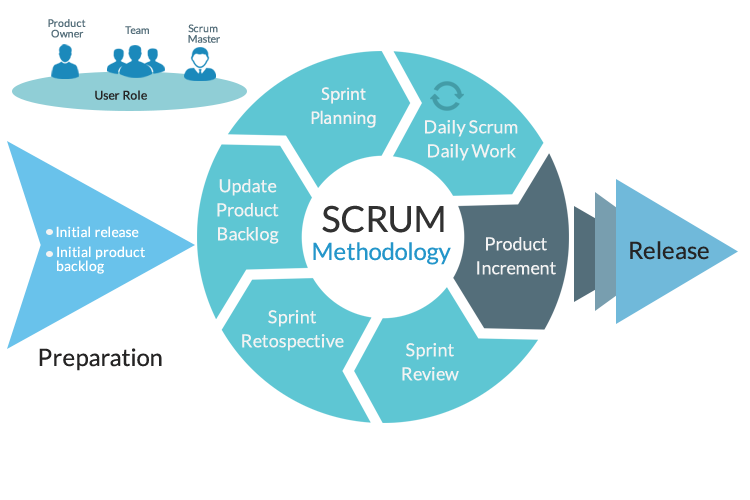

# 🍽️ Proyecto de Inversión Gastronómica y Afines en el Mercado de Estados Unidos 🇺🇸

## ROLES Y RESPONSABILIDADES: 👨‍💼👨‍💼👨‍💼👨‍💼👨‍💼

- Víctor Vargas ➡️ Data Engineer
- Guillermo del Río ➡️ Data Science
- Michael Martínez ➡️ Data Engineer
- Julián Scarpeccio ➡️ Data Science
- Benjamín Zelaya ➡️ Data Analyst

## Entendimiento de la situación propuesta 🤔

### Descripción del Proyecto

El cliente, que forma parte de un conglomerado de empresas en el sector de restaurantes y afines, busca realizar un análisis exhaustivo de las opiniones de los usuarios en las plataformas Yelp y Google Maps en relación a restaurantes, hoteles y otros negocios relacionados con el turismo y el ocio. Este análisis se centrará en hoteles, restaurantes y otros negocios relacionados con el turismo y el ocio. El cliente también está interesado en identificar ubicaciones estratégicas para abrir nuevos restaurantes y proporcionar recomendaciones personalizadas a los usuarios.

Para llevar a cabo este proyecto, el cliente ha contratado a Icon Data Science Consulting como consultores externos. La tarea principal es estudiar la relación entre las reseñas de diferentes tipos de negocios, que incluyen restaurantes, hoteles, y otros servicios. Además, se analizarán datos como la cantidad de locales de restaurantes, sus nombres y franquicias, así como el tipo de oferta gastronómica que ofrecen. El objetivo es evaluar la viabilidad de introducir una propuesta gastronómica completamente nueva o incorporar una franquicia existente en ubicaciones estratégicas.

## Objetivos del Proyecto 🎯

### Objetivos del Trabajo:
- Recopilar y depurar datos de diferentes fuentes para crear una base de datos.
- Realizar un análisis exploratorio de los datos para encontrar relaciones.
- Crear un dashboard interactivo y visualmente atractivo que integre los resultados del análisis exploratorio de datos.
- Entrenar y poner en producción un modelo de machine learning para proponer una oportunidad de inversión en el sector.

### Objetivos del Grupo:
- Investigar y analizar los conjuntos de datos de locales gastronómicos y sus franquicias en cada uno de los conglomerados para identificar tendencias.
- Entender la correlación entre los tipos de locales gastronómicos, franquicias y reviews con el fin de proporcionar una base sólida para las decisiones futuras relacionadas con la oportunidad de inversión.

## 3. Alcance y fuera de alcance 🚧

### Alcance
- Recopilación, limpieza y análisis de datos de restaurantes, tipos de restaurantes, franquicias, ubicaciones, población y reseñas.
- Análisis exploratorio de datos para identificar patrones y tendencias.
- Correlación entre datos de tipos de locales gastronómicos, franquicias y reseñas.
- Implementación de métricas e indicadores para evaluar aspectos relacionados con ofertas gastronómicas y franquicias, y su relación con clientes y reseñas.
- Incorporación de datasets adicionales con información relevante y confiable.

### Fuera de Alcance
- Implementación práctica de la construcción, diseño y operación de restaurantes o franquicias.
- Análisis detallado de aspectos económicos, logísticos y regulatorios.

## 4. Análisis preliminar de Calidad del dato 📊

Se realizó un análisis preliminar y transformaciones de los conjuntos de datos dados por la empresa y obtenidos externamente para así observar la calidad de los datos, concatenar archivos, limpiar valores nulos, observar tipos de datos y realizar gráficos que nos ayuden a comprender la información. Podemos observar los archivos dentro de la carpeta sprint_1 llamado ETL y EDA.

## KPI 📈

### Tasa de Satisfacción del Cliente
Este KPI mide el porcentaje de clientes satisfechos en función de las reseñas y opiniones recopiladas en plataformas como Yelp y Google Maps.
Tasa de Satisfacción del Cliente = (Número de Reseñas Positivas / Total de Reseñas) x 100

### Rentabilidad por Ubicación
Permite identificar cuáles son las ubicaciones más rentables y cuáles pueden requerir mejoras.
Rentabilidad por Ubicación = (Ingresos - Costos) / Ingresos x 100

### Porcentaje de Restaurantes con Alta Calificación
Este KPI muestra el porcentaje de restaurantes que tienen una calificación por encima de un umbral específico (por ejemplo, 4 estrellas).
Porcentaje de Restaurantes con Alta Calificación = (Número de Restaurantes con Rating >= Umbral) / Total de Restaurantes x 100

### Diferencia Promedio de Rating por Estado
Identificar si la calidad de los restaurantes varía significativamente de un estado a otro.
Diferencia Promedio de Rating por Estado = Promedio de "Rating" agrupado por "Estado".

## Metodologia propuesta 📅

En este proyecto, estamos empleando la metodología ágil mediante el marco de trabajo Scrum utilizando el software de administración de proyectos Trello. Esto conlleva la incorporación de los valores y conceptos ágiles en nuestro enfoque de desarrollo. Estamos aplicando la estructura definida por Scrum en términos de roles, eventos, artefactos y reglas para la organización y gestión efectiva del trabajo colaborativo.

## **Stack tecnológico** 💻

Para llevar a cabo nuestro proyecto hemos seleccionado las siguientes tecnologías:

- Trabajo diario: Python, Google Meet, [GitHub](https://github.com).
- Ingeniería de datos: Python, MySQL, Docker, [Apache Airflow](https://airflow.apache.org).
- Análisis y visualización de datos: [Power BI](https://powerbi.microsoft.com), Python.
- Modelo de machine learning: Python.
- Gestión de proyectos: [Trello](https://trello.com).

## Data Pipeline 📊

En esta sección se estructurará el flujo de datos desde la recepción hasta la salida del ETL.

### Data Ingest
Los datos entregados por la empresa y extraídos por nuestro equipo mediante API y web scraping se descargaron y son almacenados de manera temporal en el localhost de nuestra máquina. Dado que trabajaremos sobre el esquema de Microsoft Azure se creará un contenedor donde se almacenarán los datasets sin procesar en la nube. Para esto, fue necesario crear una cuenta de trabajo en el portal de Azure. En dicha cuenta se crea un grupo de recursos donde incluímos una cuenta de almacenamiento con un contenedor.

### Conexión con Databricks
Una vez almacenados los datasets en el contenedor de Azure se procede a realizar la conexión con Databricks, nuestro lugar de trabajo principal. En el grupo de recursos previamente creado se añade un workspace de Databricks. Ahí se creará un clúster que permite computar nuestros datos (Single Node 10.4 LTS Apache Spark 14 GB Memory, 4 Cores), el criterio de selección es en base al alcance de nuestros recursos. Dentro de Databricks creamos un Notebook y lo conectamos con el clúster. En dicho Notebook establecemos las variables necesarias para la conexión con el contenedor.

### ETL
Se realizará todo el proceso de extracción, transformación y carga de los datos hacia el data warehouse.

### Conexión con SQL Database
Creada la SQL Database de Azure se realizará la conexión con Databricks por medio del protocolo JDBC.

### Conexión con Power BI
La conexión se realiza mediante el conector de Azure SQL Database de Power BI. Se ingresan las credenciales del servidor de base de datos y se cargan los datos ya sea por Direct Query o Import Data.
