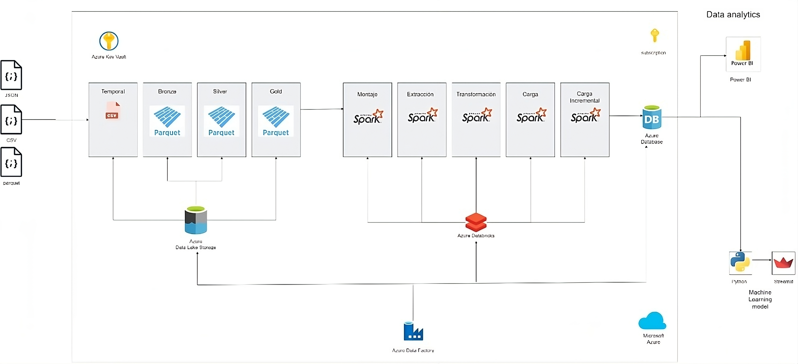
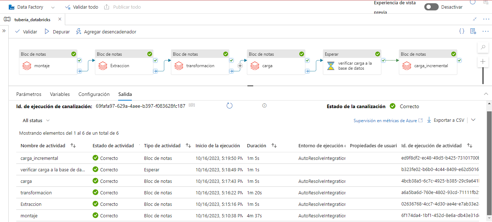

# 🍽️ Proyecto de Inversión Gastronómica y Afines en el Mercado de Estados Unidos 🇺🇸

## ROLES Y RESPONSABILIDADES: 👨‍💼👨‍💼👨‍💼👨‍💼👨‍💼

- Víctor Vargas ➡️ Data Engineer
- Michael Martínez ➡️ Data Engineer
- Guillermo del Río ➡️ Data Science
- Benjamín Zelaya ➡️ Data Science
- Julián Scarpeccio ➡️ Data Analyst

## Entendimiento de la situación propuesta 🤔

### Descripción del Proyecto

El cliente, que forma parte de un conglomerado de empresas en el sector de restaurantes y afines, busca realizar un análisis exhaustivo de las opiniones de los usuarios en las plataformas Yelp y Google Maps en relación a restaurantes, hoteles y otros negocios relacionados con el turismo y el ocio. Este análisis se centrará en hoteles, restaurantes y otros negocios relacionados con el turismo y el ocio. El cliente también está interesado en identificar ubicaciones estratégicas para abrir nuevos restaurantes y proporcionar recomendaciones personalizadas a los usuarios.

Para llevar a cabo este proyecto, el cliente ha contratado a Icon Data Science Consulting como consultores externos. La tarea principal es estudiar la relación entre las reseñas de diferentes tipos de negocios, que incluyen restaurantes, hoteles, y otros servicios. Además, se analizarán datos como la cantidad de locales de restaurantes, sus nombres y franquicias, así como el tipo de oferta gastronómica que ofrecen. El objetivo es evaluar la viabilidad de introducir una propuesta gastronómica completamente nueva o incorporar una franquicia existente en ubicaciones estratégicas.

## Objetivos del Proyecto 🎯

### Objetivos del Trabajo:
- Recopilar y depurar datos de diferentes fuentes para crear una base de datos.
- Realizar un análisis exploratorio de los datos para encontrar relaciones.
- Crear un dashboard interactivo y visualmente atractivo que integre los resultados del análisis exploratorio de datos.
- Entrenar y poner en producción un modelo de machine learning para proponer una oportunidad de inversión en el sector.

## Alcance 🚧

### Alcance
Recopilación, limpieza y análisis de datos de restaurantes, su tip, frnaquicias, ubicaciones, poblacion y reseñas estratificando en 3 grupos de estados su densidad poblacional
- Alta
- Media
- Baja

## KPI 📈

### Tasa de Satisfacción del Cliente:
- Descripción: Este KPI mide el porcentaje de clientes satisfechos en función del rating de opiniones recopiladas en plataformas como Yelp y Google Maps. 
- Calificación: por encima de un umbral específico de puntuación de Rating >= 4 .
- Fórmula: Tasa de Satisfacción del Cliente = (Número de Rating/ Total de Rating) x 100

### Cantidad de Sucursales por Conglomerado de Estados:
- Definición: Este KPI permite identificar cuántas sucursales tendrás por conglomerado de estados.
- Objetivo: Determinar la expansión y presencia de las franquicias en cada categoría de estados, lo que puedeindicar oportunidades de crecimiento o saturación delmercado.

### Porcentaje de Restaurantes con Alta Calificación:
- Definición: Este KPI muestra el porcentaje de restaurantes que tienen una calificación por encima de un umbralespecífico (por ejemplo, 4 estrellas).
- Fórmula: Porcentaje de Restaurantes con Alta Calificación = (Número de Restaurantes con Rating >= Umbral) / Total de Restaurantes x 100
- Objetivo: Evaluar la calidad general de las franquicias en cada categoría de estados y destacar las que tienen una alta calificación.

### Top 5 Franquicias por Conglomerado de Estados:
- Definición: Este KPI identifica las mejores franquicias por conglomerado de estados.
- Objetivo: Identificar las franquicias más exitosas en términos de presencia y calificación en cada categoríade estados, lo que puede servir como referencia para futuras inversiones.

###  Comparación de Satisfacción del Cliente Promedio por Estado con el Nivel de Satisfacción de la Franquicia Elegida:
- Descripción: Este indicador se establece con el propósito de evaluar el nivel de satisfacción del cliente en la franquicia elegida por el inversor y compararlo con la satisfacción promedio de los clientes dentro del estado en el que se realizó la inversión. 
Si el nivel Promedio de satisfacción de nuestra Franquicia está por encima del promedio del estado significa que estamos por encima de la media y que mantenemos la calidad y servicio a nuestros clientes, lo cual nos indica un buen desempeño.

### Comparación del Nivel de Satisfacción del Cliente en Franquicias Seleccionadas frente al Promedio Nacional.
- Descripción: Este indicador de desempeño tiene como objetivo evaluar la satisfacción de los clientes en la franquicia que se ha seleccionado por el inversor, y contrastar con la satisfacción promedio de los usuarios en dicha franquicia a nivel nacional.

## Data Pipeline 🚀 

En esta sección se estructurará el flujo de datos desde la recepción hasta la salida del ETL.

### ETL_LOCAL 
Los datos entregados por la empresa y extraídos por nuestro equipo mediante api y web scraping se descargaron y son almacenados de manera temporal en el localhost de nuestra máquina, posteriormente se realizaron los siguientes pasos.

#### extracción: 
se descargaron los datos dados por la empresa en el cual son los de google maps y yelp, también se obtuvieron datos de fuentes externas que fueron los de estados que nos muestra la cantidad de población que hay en cada estado y el de inversión de franquicias que nos da a conocer la mínima y máxima inversión que se realiza a cada franquicia.

#### transformación:

**`google maps`**: se consolidó un dataset resultante que fue por la unión de dos dataset también consolidados 
que son estados y sitios unidos que posteriormente se filtró por la categoría de restaurantes que es el tipo de negocio que se estudiará.

**`yelp`**: se consolidó un dataset resultante llamado yelp en el cual se filtró por tres columnas a utilizar que son comentarios, latitud y longitud en el cual nos permite tener los comentarios de cada review dada y la ubicación de dicho local para posteriormente relacionarlo con el dataset de google.

**`población`**: se consolidó el dataset población filtrando la columna estado y cantidad de población posteriormente realizando una columna nueva llamada categoría de densidad en el cual se divide por baja, media y alta la población de cada estado.
Inversión de franquicias: se observó el dataset para un posterior análisis.

**`Inversión de franquicias`**: se observó el dataset para un posterior análisis

### AZURE

### 📥 Data Ingest
Dado que trabajaremos sobre el esquema de Microsoft Azure se creó un contenedor 🗃️ de tipo data lake donde se almacenan los datasets obtenidos del etl local en el cual se le seguirán haciendo transformaciones en la nube. Para esto, fue necesario crear una cuenta de trabajo en el portal de Azure. En dicha cuenta se crea un grupo de recursos donde incluimos una cuenta de almacenamiento con un contenedor.

### Azure data lake storage: 
Dentro del contenedor creamos cuatro folders que son.

**`Temporal`**: se cargan los datos en crudo.

**`Bronze`**: se hace una copia de los datos que están en temporal pero en formato delta para así mejorar el procesamiento de cómputo de databricks.

**`Silver`**: tenemos los datos ya transformados y limpios.

**`Gold`**: tenemos datos finales con agrupaciones que serán cargados a la base de datos

### 🌐 Conexión con Databricks
Una vez almacenados los datasets en el contenedor de Azure se procede a realizar la conexión con Databricks, nuestro lugar de trabajo principal. En el grupo de recursos previamente creado se añade un workspace de Databricks. Ahí se creará un clúster ☁️ que permite computar nuestros datos (Single Node 10.4 LTS Apache Spark 14 GB Memory, 4 Cores), el criterio de selección es en base al alcance de nuestros recursos. Dentro de Databricks creamos un Notebook 📓 y lo conectamos con el clúster. En dicho Notebook establecemos las variables necesarias para la conexión con el contenedor.

### 🔄 ETL  02 Azure:
se dividió los procesos en cuadernos de databricks:

**montaje**: se definen las variables para hacer la conexión hacia el azure data lake y su contenedor, se realiza el montaje y se listan las rutas de los folder que se trabajarán.

**extracción**: se definen las librerías y rutas a utilizar, se estructura cada dataset con sus nombres de columnas y tipo de datos para luego cargar y visualizar los datos de la capa temporal posteriormente se cargan estos datos a la capa bronze que son una copia de la capa temporal en formato delta para aprovechar los recursos de databricks y procese los datos con mayor rapidez.

**transformación**:

- **`población`**: se carga el dataset de la capa bronze, se realiza una columna nueva llamada id estado que será nuestra llave primaria, se eliminan registros no necesarios y se carga el dataset limpio a la capa silver cambiando de nombre estado.

- **`franquicias`**: se carga el dataset de la capa bronze, se eliminan duplicados, se realiza la columna id franquicia que será su llave primaria y guardó en el folder silver.

- **`google`**: se carga el dataset de la capa bronze, se eliminan columnas innecesarias, se cambian registros con caracteres especiales, se crea columna id google que será su llave primaria y guardó el dataset ya limpio en el folder silver.
 yelp: cargo del folder bronce, se eliminó columnas y duplicados que son innecesarios y guardó el dataset ya limpio en silver.

- **`Reviews`**: se carga los dataset google y yelp de la capa silver y se realizan un join por medio de sus columnas latitud y longitud para formar un solo archivo llamado reviews que será´ nuestra tabla de hechos en el cual contiene toda nuestra información valiosa; posteriormente los relaciono con los dataset de estados y franquicias para añadir su llave foránea y poder relacionar los tres dataset finales, para finalizar también es guardado en silver.

En conclusión se formaron tres dataset finales que son llamados reviews, estados y franquicias, estos dataset son particionados en un 50% cada uno y son creados 6 dataset para posteriormente cargados en el folder gold.

**carga**: se cargan los 3 primeros dataset finales de la capa gold en el cual se realiza una primera carga a la base de datos.

**carga incremental**:se cargan los 3 dataset finales restantes de la capa gold en el cual se realiza la segunda carga a la base de datos.
previo a esto se realizó la configuración de conexión entre databricks y la base de datos sql para cargar estos dataframe por medio del protocolo jdbc.

### 📊 Conexión con SQL Database
Creada la SQL Database de Azure se realizará la conexión con Databricks por medio del protocolo jdbc.
Los datos procesados se almacenan en una base de datos SQL, donde la estrategia de almacenamiento se divide en dos etapas. En la primera carga, se almacena el 50% de los datos, y luego se procede con una segunda carga incremental para completar la base de datos. Esta metodología permite una gestión eficiente y escalable de la información procesada

### Azure Data Factory (Proceso ETL Automatizado):

Se utiliza Azure Data Factory como un orquestador de datos utilizando cada notebook de databrick en forma de tarea y secuencial. Esta combinación permite automatizar el flujo de datos y realizar una carga incremental de manera altamente eficiente.

- [Video data pipeline automatizado y carga incremental](https://drive.google.com/file/d/1nHeeCC9GLgrzPIHLwp6LGP_-Im_WeV2s/view?usp=sharing): Aquí encontrarás el video completo en azure data factory automatizando el data pipeline y haciendo carga y carga incremental a la base de datos.

### 📈 Conexión con Power BI
La conexión se realiza mediante el conector de Azure SQL Database de PowerBI. Se ingresan las credenciales del servidor de base de datos y se cargan los datos ya sea por Direct Query o Import Data.
Una vez que los datos se encuentran en la base de datos, se pueden analizar y visualizar utilizando Power BI. Esto permite identificar tendencias, patrones y obtener información valiosa para la toma de decisiones informadas.

**Link de acceso al Dashboard de Power Bi:** https://drive.google.com/file/d/155PmIm5dQmAJaOL_PkCwdmWfu-2qJgDG/view

- [Tambien lo pueden encontrar dentro el repositorio haciendo clik aquí](https://github.com/gdelrio0410/PF_DS_REVIEWS_AND_RECOMMENDATIONS/blob/main/Sprint_3/PF%20Power%20Bi%20v2.pbix)

### 
### Modelo de Machine Learning y Dashboard de Streamlit

Este proyecto representa una impresionante combinación de un modelo de Machine Learning y un dinámico dashboard creado con Streamlit. El dashboard ofrece cinco pestañas personalizadas, cada una con su conjunto de funcionalidades distintivas:

* Categoría según niveles de densidad demográfica y Estado seleccionado

Permite a los usuarios seleccionar una categoría de densidad demográfica y un estado específico.
Muestra un gráfico de barras interactivo que presenta la cantidad de sucursales de franquicias en función de la categoría.

* Franquicias según categoría y rango de Promedio de Rating

Permite a los usuarios seleccionar una categoría de franquicia y un rango de promedio de calificación.
Muestra un gráfico interactivo de las franquicias recomendadas que cumplen con los criterios seleccionados.

* Franquicias por Rango de Inversión seleccionado

Los usuarios pueden definir un rango de inversión y el número de franquicias que desean ver.
Presenta un gráfico de burbujas que representa el rango de inversión y el ratio de inversión de las franquicias.

* Sucursales con mejor rating de la Franquicia Seleccionada

Permite a los usuarios seleccionar una franquicia de una lista de franquicias que tienen al menos un número mínimo de sucursales.
Muestra un mapa interactivo que resalta la sucursal de la franquicia seleccionada con el mejor promedio de calificación.

* Predicción de Promedio de Rating de Franquicia

Este proyecto se centra en la creación de un modelo de Machine Learning de regresión y su implementación en un atractivo dashboard interactivo construido con Streamlit. El modelo utiliza datos diversos, incluyendo inversiones, poblaciones, ubicaciones geográficas y más, para predecir el promedio de calificaciones de franquicias. El modelo de Machine Learning, basado en el algoritmo "Random Forest Regressor," ha sido ajustado y evaluado cuidadosamente, logrando métricas de alto rendimiento, como un alto coeficiente de determinación (R2), un error cuadrático medio raíz (RMSE) bajo y un error absoluto medio (MAE) reducido.

La interfaz de usuario interactiva desarrollada en Streamlit permite a los usuarios ingresar sus propios valores para características relevantes, como inversión, población y ubicación, y obtener recomendaciones personalizadas en tiempo real. Además, hemos incluido la codificación numérica de nombres de estados y números de franquicias para facilitar el procesamiento de datos categóricos. Este proyecto combina la potencia del Machine Learning con la accesibilidad de una interfaz de usuario intuitiva y amigable, demostrando cómo la inteligencia artificial puede estar al alcance de una audiencia más amplia. 

- [Video Dashboard](https://drive.google.com/file/d/1Y0UlDbot1GrV2eoeL-SW43ow6F7bM3pp/view?usp=share_link): Aquí encontrarás el video del Dashboard de Icon Data Science Consulting.

## Documentación de los Sprints

- [Documentación del Sprint 1](https://github.com/gdelrio0410/PF_DS_REVIEWS_AND_RECOMMENDATIONS/blob/11fa2d842c55cc39003a3b8ced99d5d94c5a2e75/sprint_1/Documentacion_sprint_1.pdf): Aquí encontrarás información detallada sobre el trabajo realizado en el primer sprint, incluyendo objetivos, tareas completadas y resultados obtenidos.

- [Documentación del Sprint 2](https://github.com/gdelrio0410/PF_DS_REVIEWS_AND_RECOMMENDATIONS/blob/477bd10e83a49c89c5c118645e909ac753378ff4/sprint_2/Documentacion%20Sprint%202.pdf): En este enlace, puedes acceder a la documentación del segundo sprint, que incluye detalles sobre las metas alcanzadas, las tareas realizadas y cualquier información relevante relacionada con el proyecto.

Te invitamos a explorar estos documentos para obtener una visión más completa del progreso y los logros de nuestro proyecto de inversión gastronómica en el mercado de Estados Unidos.

