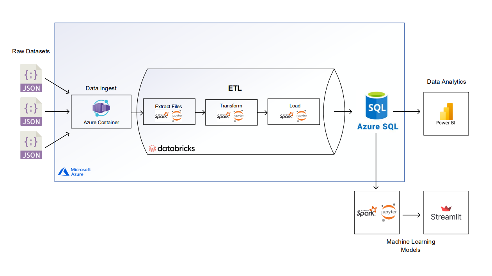

# 🍽️ Proyecto de Inversión Gastronómica y Afines en el Mercado de Estados Unidos 🇺🇸

## ROLES Y RESPONSABILIDADES: 👨‍💼👨‍💼👨‍💼👨‍💼👨‍💼

- Víctor Vargas ➡️ Data Engineer
- Michael Martínez ➡️ Data Engineer
- Guillermo del Río ➡️ Data Science
- Benjamín Zelaya ➡️ Data Science
- Julián Scarpeccio ➡️ Data Analyst

## Entendimiento de la situación propuesta 🤔

### Descripción del Proyecto

El cliente, que forma parte de un conglomerado de empresas en el sector de restaurantes y afines, busca realizar un análisis exhaustivo de las opiniones de los usuarios en las plataformas Yelp y Google Maps en relación a restaurantes, hoteles y otros negocios relacionados con el turismo y el ocio. Este análisis se centrará en hoteles, restaurantes y otros negocios relacionados con el turismo y el ocio. El cliente también está interesado en identificar ubicaciones estratégicas para abrir nuevos restaurantes y proporcionar recomendaciones personalizadas a los usuarios.

Para llevar a cabo este proyecto, el cliente ha contratado a Icon Data Science Consulting como consultores externos. La tarea principal es estudiar la relación entre las reseñas de diferentes tipos de negocios, que incluyen restaurantes, hoteles, y otros servicios. Además, se analizarán datos como la cantidad de locales de restaurantes, sus nombres y franquicias, así como el tipo de oferta gastronómica que ofrecen. El objetivo es evaluar la viabilidad de introducir una propuesta gastronómica completamente nueva o incorporar una franquicia existente en ubicaciones estratégicas.

## Objetivos del Proyecto 🎯

### Objetivos del Trabajo:
- Recopilar y depurar datos de diferentes fuentes para crear una base de datos.
- Realizar un análisis exploratorio de los datos para encontrar relaciones.
- Crear un dashboard interactivo y visualmente atractivo que integre los resultados del análisis exploratorio de datos.
- Entrenar y poner en producción un modelo de machine learning para proponer una oportunidad de inversión en el sector.

## Alcance 🚧

### Alcance
Recopilación, limpieza y análisis de datos de restaurantes, su tip, frnaquicias, ubicaciones, poblacion y reseñas estratificando en 3 grupos de estados su densidad poblacional
- Alta
- Media
- Baja

## KPI 📈

### Tasa de Satisfacción del Cliente:
- Descripción: Este KPI mide el porcentaje de clientes satisfechos en función del rating de opiniones recopiladas en plataformas como Yelp y Google Maps. 
- Calificación: por encima de un umbral específico de puntuación de Rating >= 4 .
- Fórmula: Tasa de Satisfacción del Cliente = (Número de Rating/ Total de Rating) x 100

### Cantidad de Sucursales por Conglomerado de Estados:
- Definición: Este KPI permite identificar cuántas sucursales tendrás por conglomerado de estados.
- Objetivo: Determinar la expansión y presencia de las franquicias en cada categoría de estados, lo que puedeindicar oportunidades de crecimiento o saturación delmercado.

### Porcentaje de Restaurantes con Alta Calificación:
- Definición: Este KPI muestra el porcentaje de restaurantes que tienen una calificación por encima de un umbralespecífico (por ejemplo, 4 estrellas).
- Fórmula: Porcentaje de Restaurantes con Alta Calificación = (Número de Restaurantes con Rating >= Umbral) / Total de Restaurantes x 100
- Objetivo: Evaluar la calidad general de las franquicias en cada categoría de estados y destacar las que tienen una alta calificación.

### Top 5 Franquicias por Conglomerado de Estados:
- Definición: Este KPI identifica las mejores franquicias por conglomerado de estados.
- Objetivo: Identificar las franquicias más exitosas en términos de presencia y calificación en cada categoríade estados, lo que puede servir como referencia para futuras inversiones.

###  Comparación de Satisfacción del Cliente Promedio por Estado con el Nivel de Satisfacción de la Franquicia Elegida:
- Descripción: Este indicador se establece con el propósito de evaluar el nivel de satisfacción del cliente en la franquicia elegida por el inversor y compararlo con la satisfacción promedio de los clientes dentro del estado en el que se realizó la inversión. 
Si el nivel Promedio de satisfacción de nuestra Franquicia está por encima del promedio del estado significa que estamos por encima de la media y que mantenemos la calidad y servicio a nuestros clientes, lo cual nos indica un buen desempeño.

### Comparación del Nivel de Satisfacción del Cliente en Franquicias Seleccionadas frente al Promedio Nacional.
- Descripción: Este indicador de desempeño tiene como objetivo evaluar la satisfacción de los clientes en la franquicia que se ha seleccionado por el inversor, y contrastar con la satisfacción promedio de los usuarios en dicha franquicia a nivel nacional.

## Data Pipeline 🚀 

En esta sección se estructurará el flujo de datos desde la recepción hasta la salida del ETL.

### 📥 Data Ingest
Los datos entregados por la empresa y extraídos por nuestro equipo mediante API y web scraping se descargaron y son almacenados de manera temporal en el localhost de nuestra máquina. Dado que trabajaremos sobre el esquema de Microsoft Azure se creará un contenedor 🗃️ donde se almacenarán los datasets sin procesar en la nube. Para esto, fue necesario crear una cuenta de trabajo en el portal de Azure. En dicha cuenta se crea un grupo de recursos donde incluímos una cuenta de almacenamiento con un contenedor.

### 🌐 Conexión con Databricks
Una vez almacenados los datasets en el contenedor de Azure se procede a realizar la conexión con Databricks, nuestro lugar de trabajo principal. En el grupo de recursos previamente creado se añade un workspace de Databricks. Ahí se creará un clúster ☁️ que permite computar nuestros datos (Single Node 10.4 LTS Apache Spark 14 GB Memory, 4 Cores), el criterio de selección es en base al alcance de nuestros recursos. Dentro de Databricks creamos un Notebook 📓 y lo conectamos con el clúster. En dicho Notebook establecemos las variables necesarias para la conexión con el contenedor.

### 🔄 ETL
Se realizará todo el proceso de extracción, transformación y carga de los datos hacia el data warehouse.

### 📊 Conexión con SQL Database
Creada la SQL Database de Azure se realizará la conexión con Databricks por medio del protocolo JDBC.

### 📈 Conexión con Power BI
La conexión se realiza mediante el conector de Azure SQL Database de Power BI. Se ingresan las credenciales del servidor de base de datos y se cargan los datos ya sea por Direct Query o Import Data.

## Documentación de los Sprints

- [Documentación del Sprint 1](https://github.com/gdelrio0410/PF_DS_REVIEWS_AND_RECOMMENDATIONS/blob/11fa2d842c55cc39003a3b8ced99d5d94c5a2e75/sprint_1/Documentacion_sprint_1.pdf): Aquí encontrarás información detallada sobre el trabajo realizado en el primer sprint, incluyendo objetivos, tareas completadas y resultados obtenidos.

- [Documentación del Sprint 2](https://github.com/gdelrio0410/PF_DS_REVIEWS_AND_RECOMMENDATIONS/blob/11fa2d842c55cc39003a3b8ced99d5d94c5a2e75/sprint_2/documentacion_sprint_2.pdf): En este enlace, puedes acceder a la documentación del segundo sprint, que incluye detalles sobre las metas alcanzadas, las tareas realizadas y cualquier información relevante relacionada con el proyecto.

Te invitamos a explorar estos documentos para obtener una visión más completa del progreso y los logros de nuestro proyecto de inversión gastronómica en el mercado de Estados Unidos.

